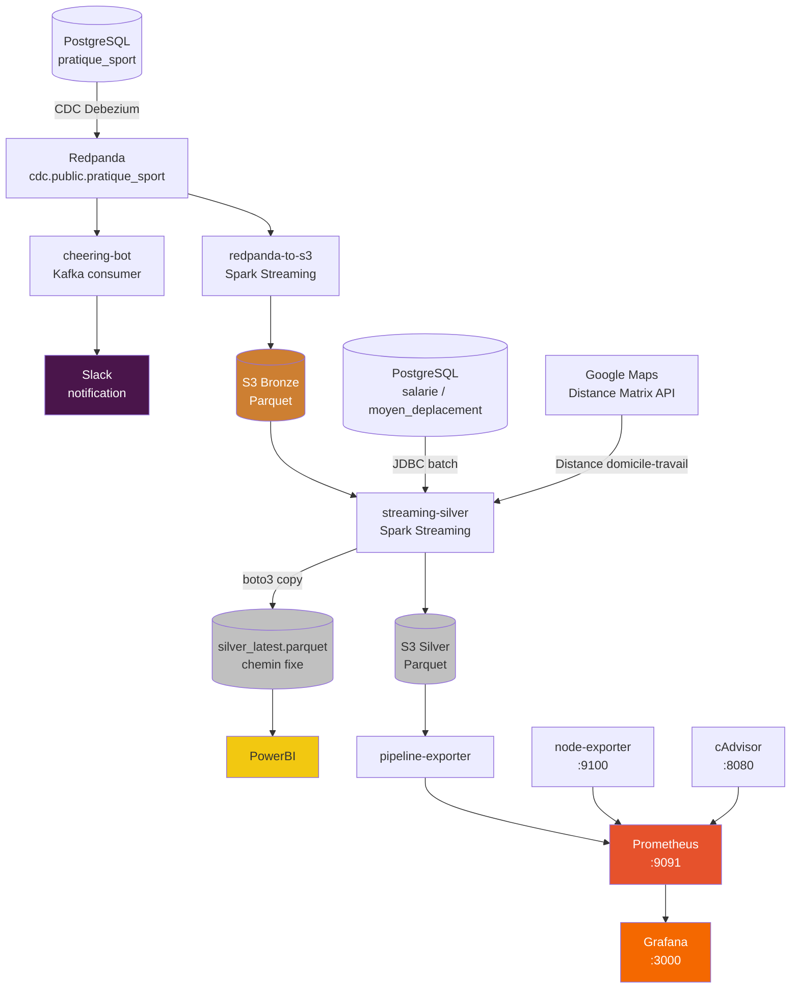

# SportDataSolution — Pipeline de données temps réel

Pipeline de données complet pour le suivi des activités sportives des employés et l'analyse de la mobilité douce, basé sur une architecture streaming Bronze/Silver avec CDC PostgreSQL, Apache Spark, S3 et monitoring Grafana.

---

## Architecture générale



### Couches de données (Medallion Architecture)

| Couche | Chemin S3 | Description |
|--------|-----------|-------------|
| **Bronze** | `pratique_sportives/parquet/` | Événements CDC bruts, format Debezium décodé |
| **Silver** | `silver/mobilite_douces_employe_sport/parquet/` | Données enrichies — employés, distances, cohérence mobilité |
| **PowerBI** | `silver/mobilite_douces_employe_sport/silver_latest.parquet` | Fichier stable à chemin fixe pour PowerBI |

---

## Services

| Service | Rôle | Image |
|---------|------|-------|
| `cheering-bot` | Consomme Redpanda → notification Slack par activité | `python:3.11-slim` |
| `redpanda-to-s3` | Lit Redpanda → écrit Parquet Bronze sur S3 | `eclipse-temurin:17` + PySpark 4.1.1 |
| `streaming-silver` | Surveille Bronze S3, joint PostgreSQL, valide distances Google Maps → Silver | `eclipse-temurin:17` + PySpark 4.1.1 |
| `pipeline-exporter` | Lit `silver_latest.parquet` → métriques Prometheus (:9101) | `python:3.11-slim` |
| `prometheus` | Collecte métriques (:9091) | `prom/prometheus` |
| `grafana` | Dashboard visualisation (:3000) | `grafana/grafana` |
| `node-exporter` | Métriques système hôte (:9100) | `prom/node-exporter` |
| `cadvisor` | Métriques containers Docker (:8080) | `gcr.io/cadvisor/cadvisor` |

---

## Stack technique

| Composant | Technologie |
|-----------|-------------|
| Broker de messages | Redpanda (compatible Kafka) |
| CDC | Debezium (connecteur PostgreSQL) |
| Traitement streaming | Apache Spark 4.1.1 / PySpark |
| Stockage objet | AWS S3 (via hadoop-aws 3.4.2) |
| Format données | Apache Parquet |
| Base de données | PostgreSQL |
| Géolocalisation | Google Maps Distance Matrix API |
| Notifications | Slack Webhooks |
| Qualité données | Great Expectations |
| Monitoring | Prometheus + Grafana + cAdvisor + node_exporter |
| Conteneurisation | Docker / Docker Compose |
| Visualisation BI | PowerBI (via `silver_latest.parquet`) |

---

## Prérequis

- Docker ≥ 24 et Docker Compose ≥ 2.20
- Redpanda en cours d'exécution sur la machine hôte (`127.0.0.1:9092`)
- PostgreSQL accessible sur le réseau local (`192.168.1.177:5432`)
- Un bucket S3 AWS configuré
- Une clé API Google Maps (Distance Matrix)
- Un Webhook Slack entrant

---

## Installation et démarrage

### 1. Configurer les variables d'environnement

```bash
cp docker/.env.example .env
# Renseigner les valeurs dans .env
```

| Variable | Description |
|----------|-------------|
| `AWS_ACCESS_KEY` | Clé d'accès AWS |
| `AWS_SECRET_KEY` | Clé secrète AWS |
| `AWS_REGION` | Région S3 (ex. `eu-west-3`) |
| `AWS_S3_BUCKET` | Nom du bucket S3 |
| `PG_USER` | Utilisateur PostgreSQL |
| `PG_PASSWORD` | Mot de passe PostgreSQL |
| `DATABASE_URL` | URL SQLAlchemy complète |
| `GMAPS_API_KEY` | Clé API Google Maps |
| `SLACK_WEBHOOK_URL` | URL Webhook Slack entrant |
| `REDPANDA_BROKER` | Adresse broker Redpanda (défaut : `127.0.0.1:9092`) |

### 2. Configurer le CDC Debezium sur Redpanda

```bash
# Démarrer le connecteur Debezium (voir config_json_debezium.txt)
curl -X POST http://localhost:8083/connectors \
  -H "Content-Type: application/json" \
  -d @config_json_debezium.txt
```

### 3. Construire et démarrer le pipeline

```bash
# Tous les services (pipeline + monitoring)
docker compose -f docker/docker-compose.yml up --build -d

# Un seul service
docker compose -f docker/docker-compose.yml up cheering-bot
docker compose -f docker/docker-compose.yml up redpanda-to-s3
docker compose -f docker/docker-compose.yml up streaming-silver
```

### 4. Démarrage local (hors Docker)

```bash
# Bronze : Redpanda → S3
conda run -n SportDataSolution spark-submit \
  --master local[*] \
  --packages org.apache.hadoop:hadoop-aws:3.4.2,org.apache.spark:spark-sql-kafka-0-10_2.13:4.1.1 \
  code/python/redpanda_to_s3_parquet.py

# Silver : S3 + PostgreSQL
conda run -n SportDataSolution spark-submit \
  --master local[*] \
  --packages org.apache.hadoop:hadoop-aws:3.4.2,org.postgresql:postgresql:42.7.3 \
  code/python/streaming_silver_mobilite_sport.py

# Cheering bot
conda run -n SportDataSolution python code/python/cheering_crowd_bot.py
```

---

## Monitoring

| Interface | URL | Accès |
|-----------|-----|-------|
| Grafana | http://localhost:3000 | admin / admin |
| Prometheus | http://localhost:9091 | — |
| cAdvisor | http://localhost:8080 | — |

Le dashboard **SportDataSolution — Pipeline** est provisionné automatiquement dans Grafana avec :

- Activités sportives actives (total depuis Silver)
- Nombre d'employés dans le Silver
- Timestamp du dernier batch
- Évolution des activités au fil du temps
- Utilisation disque / RAM / CPU de la machine hôte

---

## Structure du projet

```
.
├── code/
│   ├── python/
│   │   ├── cheering_crowd_bot.py           # Bot Slack (Kafka consumer)
│   │   ├── redpanda_to_s3_parquet.py       # Ingestion Bronze (Spark Streaming)
│   │   ├── streaming_silver_mobilite_sport.py  # Enrichissement Silver (Spark Streaming)
│   │   ├── StravaLikeDataGen.py            # Générateur de données de test
│   │   └── data_integrity_checks.py        # Validation Great Expectations
│   ├── SQL/
│   │   ├── code_creation_bdd.sql           # Schéma PostgreSQL
│   │   └── schema_base_v1.pgerd            # Diagramme ERD
│   ├── Data_Explore.ipynb                  # Exploration des données
│   └── PySpark.ipynb                       # Analyses Spark (batch + streaming)
│
├── docker/
│   ├── docker-compose.yml                  # Orchestration 8 services
│   ├── .env.example                        # Template variables d'environnement
│   ├── README.md                           # Documentation Docker détaillée
│   ├── cheering-bot/Dockerfile
│   ├── spark/
│   │   ├── Dockerfile                      # Image Eclipse Temurin + PySpark
│   │   └── prefetch_jars.py                # Pré-téléchargement JARs Maven
│   └── monitoring/
│       ├── Dockerfile
│       ├── pipeline_exporter.py            # Exporteur métriques Prometheus
│       ├── prometheus.yml                  # Configuration scraping
│       └── grafana/
│           ├── provisioning/               # Auto-provisioning datasource + dashboards
│           └── dashboards/pipeline.json    # Dashboard SportDataSolution
│
├── data/
│   ├── Données+RH.xlsx                     # Données RH source
│   ├── Données+Sportive.xlsx               # Données sportives source
│   └── tables_sql/                         # CSV d'import PostgreSQL
│
├── RedPanda/
│   └── cdc-postgres.yaml                   # Configuration CDC Redpanda
│
├── config_json_debezium.txt                # Commande curl Debezium connector
└── .env.example → .env                     # Variables d'environnement (non versionné)
```

---

## Fonctionnement du pipeline Silver

Le service `streaming-silver` applique une logique **idempotente** :

1. À chaque nouveau fichier Bronze détecté sur S3, un micro-batch se déclenche
2. Les tables PostgreSQL (`salarie`, `moyen_deplacement`) sont rechargées fraîches
3. Seuls les employés en **mobilité douce** sont retenus (marche/running, vélo/trottinette)
4. La distance domicile-travail est validée via **Google Maps** (cache thread-safe) :
   - Marche/running ≤ 15 km
   - Vélo/trottinette ≤ 25 km
5. Le total des activités est recalculé depuis **l'intégralité du Bronze** (déduplication par `id_evenement_sportif`, dernier événement par `kafka_ts`) → les suppressions CDC sont prises en compte
6. Si le total est identique au Silver existant, l'écriture est ignorée
7. Le fichier `silver_latest.parquet` est publié sur S3 via boto3 (chemin fixe pour PowerBI)

---

## Génération de données de test

```bash
conda run -n SportDataSolution python code/python/StravaLikeDataGen.py
```

Génère 150 activités sportives aléatoires (course, vélo, natation, marche, trottinette, voile) et les insère dans PostgreSQL, ce qui déclenche automatiquement le pipeline CDC → Bronze → Silver.

---

## Qualité des données

```bash
conda run -n SportDataSolution python code/python/data_integrity_checks.py
```

Vérifie via **Great Expectations** :
- Distance > 0.01 km
- Type d'activité dans l'ensemble autorisé (`course`, `vélo`, `natation`, `marche`, `trotinette`, `voile`)

---

## Consulter les logs

```bash
# Tous les services
docker compose -f docker/docker-compose.yml logs -f

# Un service spécifique
docker compose -f docker/docker-compose.yml logs -f streaming-silver
docker compose -f docker/docker-compose.yml logs -f redpanda-to-s3
docker compose -f docker/docker-compose.yml logs -f cheering-bot
```

---

## Notes techniques

- **S3 + Spark Streaming** : `FileSystemBasedCheckpointFileManager` utilisé sur les deux scripts Spark pour contourner l'incompatibilité de S3 avec les renames atomiques
- **JARs Maven** : pré-téléchargés pendant le `docker build` dans le cache Ivy → démarrage des containers sans accès réseau Maven
- **network_mode: host** : Linux uniquement — remplacer par un bridge + `extra_hosts` sur macOS/Windows (voir `docker/README.md`)
- **Port Prometheus** : configuré sur `:9091` (port `:9090` occupé par Redpanda)
